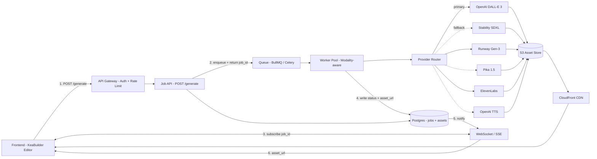

# Q2 — Multi-Provider Content Generation Routing

> Architecture for routing image, video, and voice generation requests to
> different providers, plus how the frontend and backend interact and how
> outputs are managed.

## Goals

1. Add or swap providers (DALL-E ↔ SDXL, Runway ↔ Pika, ElevenLabs ↔ OpenAI TTS)
   without touching the frontend or core API contract.
2. Per-request fallback so a single provider outage doesn't break the user flow.
3. Async-first: image/video/voice can take 5–60s; UI should not block.
4. One source of truth for *where* an asset lives (S3 + CDN) so the frontend
   gets a stable URL regardless of which provider produced it.

## Diagram



## Frontend ↔ backend interaction

| Step | Direction | Payload |
|---|---|---|
| 1 | FE → API | `POST /generate {modality, prompt, provider?, refs?}` |
| 2 | API → FE | `202 Accepted {job_id, eta_seconds}` |
| 3 | FE ↔ WS | Subscribes to `ws://.../jobs/{job_id}` |
| 4 | Worker → DB | Writes status: `queued → running → succeeded/failed` |
| 5 | DB → WS | Pushes status updates as they change |
| 6 | FE ← WS | Receives final `{status, asset_url, provider, fallback_used}` |
| 7 | FE ← CDN | Renders the asset directly from CloudFront |

The synchronous endpoint (`POST /generate` returning a `GenerationResult` directly)
shown in `router.py` is the **fast-path** for sub-second mocked generation. In
production it gets enqueued unless the modality is known-fast (e.g., short TTS).

## How the router picks a provider

```python
chain = _PROVIDER_CHAINS[modality]              # ordered: primary first
if request.provider is not None:
    chain = move_to_front(chain, request.provider)
for provider in chain:
    try:                                        # wrapped by retry decorator
        return provider.generate(prompt)
    except TransientProviderError:
        continue                                # try next in chain
raise HTTP 503                                  # whole chain exhausted
```

**Why per-modality chains, not one global router**: cost, quality, and
latency tradeoffs are modality-specific. DALL-E vs SDXL is a different
decision than Runway vs Pika.

## Output management

- **Storage**: every generated asset is written to S3 via a presigned upload
  inside the provider adapter. The S3 key encodes `{tenant}/{modality}/
  {hash(prompt)}/{provider}.{ext}` so we get free dedupe on identical prompts.
- **Serving**: only CDN URLs are returned to the frontend. CDN sits in front
  of S3 with signed URLs (15-min TTL) for private assets, public for shareable.
- **Metadata**: `assets` table holds `{id, job_id, modality, provider,
  s3_key, cdn_url, prompt_hash, created_at, used_in_funnel_id?}`. This is
  what makes Q4 (similarity search) tractable later — embeddings index this
  table.
- **Cleanup**: lifecycle rule — un-referenced assets older than 30 days move
  to S3 Glacier; deleted at 90 days. Referenced assets (linked to a live
  funnel) never expire.

## Adding a new provider

1. Subclass `BaseProvider`, implement `generate()`.
2. Append to the appropriate `_PROVIDER_CHAINS` entry.
3. (No frontend change needed — the contract is provider-agnostic.)

## Test hook

The router's `force_fail=true` flag forces the primary to raise once so the
fallback chain runs end-to-end in tests and Loom demos without simulating
an actual outage. See `samples/q2_route_*.json` for cached real-run output.
