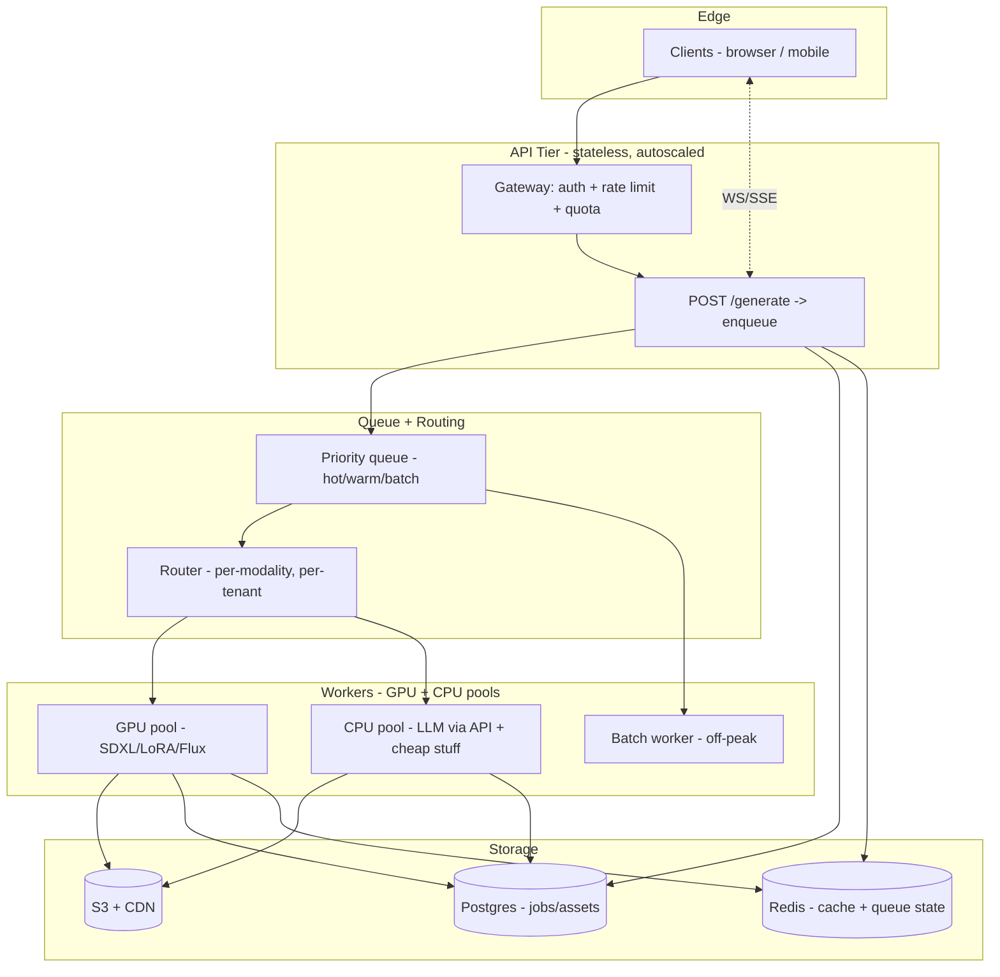

# Q6 — High-Volume Request Handling

> How would you handle a large number of users generating AI outputs at the
> same time? Address performance, cost, and reliability.

## Three-tier system

## Performance levers

| Lever | What it does | Tradeoff |
|---|---|---|
| **Async-by-default** | `POST /generate` returns `202 + job_id`; client subscribes via SSE/WS | Adds infra (queue + push channel); user must wait |
| **Priority queue** | Hot (paid demo recording), warm (interactive), batch (overnight bulk gen) | More queue logic to maintain |
| **Request batching** | Group same-modality requests in a 100ms window into one GPU forward pass | +50ms p50 latency for 5–10x GPU throughput |
| **Provider tiers** | Fast/cheap (GPT-4o-mini, SDXL-Turbo) by default; premium (GPT-4o, SDXL+LoRA) on opt-in | Quality variance |
| **Edge cache** | CDN serves any prompt-hash hit directly; never reaches workers | 0% cost on cache hits |
| **Embedding-keyed cache** | Two near-duplicate prompts (cosine > 0.95) hit the same cached output | Risks "wrong" cache hit; gate by tenant |

## Cost levers

1. **Token + image budget per tenant**: Postgres `tenant_quotas` table.
   Gateway rejects with `429 + Retry-After` when monthly cap hit.
2. **Default to cheap model**: GPT-4o-mini for classify/respond. GPT-4o
   only when classifier `confidence < 0.5` AND tenant on premium plan.
3. **Spot GPU instances** for the batch worker pool. Reserved instances for
   the hot/warm pools. ~50% cost saving on batch workloads.
4. **De-dupe before enqueue**: SHA1 of `(tenant_id, modality, prompt)` →
   if a recent identical job is queued or completed, attach the new client
   to the existing job rather than running it twice.
5. **LoRA hot-cache**: keep the last N tenant LoRAs warm in GPU RAM; cold
   tenants re-load from S3. Eviction = LRU by request count.

## Reliability levers

- **Per-modality + per-provider circuit breaker** (Q5 `circuit_breaker.py`).
  Open after 5 fails / 30s. Halts pile-on against a known-down provider.
- **Per-modality fallback chain** (Q2 `_PROVIDER_CHAINS`). Primary down →
  secondary picks up automatically.
- **Idempotency keys**: client sends `Idempotency-Key`; the job table
  enforces uniqueness so a retry-on-network-error doesn't double-spend.
- **Graceful degradation**: when GPU pool > 90% utilized, the gateway
  switches the default tier from "high quality" to "fast turbo" and surfaces
  a UI hint ("currently in fast mode"). Users can opt back into HQ but it
  may queue.
- **Health checks at 3 levels**: per-pod liveness, per-provider synthetic
  probe every 30s, end-to-end smoke job every 5m. Synthetic results feed
  the breaker so we don't wait for real users to hit a dead provider.

## What this looks like under spike load

Suppose 10× normal traffic for 30 min:

1. Gateway absorbs the spike (it's stateless and autoscaled).
2. Queue depth grows. Workers autoscale on queue-depth metric, but GPU
   warmup is ~60s — there's a transient.
3. During the transient: cheap-tier requests (LLM via vendor API) keep
   flowing. GPU-bound requests (image/video) get queued; UI shows a longer
   ETA.
4. Cache hit rate spikes (lots of users hitting popular templates).
5. Circuit breaker may open against a stressed vendor (e.g., OpenAI image)
   — fallback to SDXL automatically.
6. After 60–90s, GPU autoscale catches up; queue drains.
7. Post-spike, workers scale back down to reserved baseline.

No single component is the bottleneck because: stateless API, queued
workload, autoscaled pools, and per-provider circuit isolation.

## What I'd build first if starting from zero

1. Async API + queue + WebSocket status (1 week).
2. Provider abstraction + 1 fallback per modality (3 days).
3. Redis cache keyed on `(tenant, modality, prompt_hash)` (2 days).
4. Tenant quota + 429 enforcement (1 week, plus billing integration).
5. Then circuit breaker, LoRA hot-cache, batch coalescing, embedding-keyed
   cache — in that order, as load justifies.

Resist building all of this on day one. The async + queue + cache covers
most of the win.
